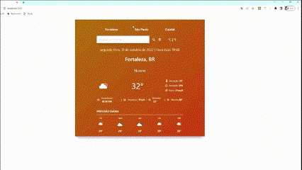
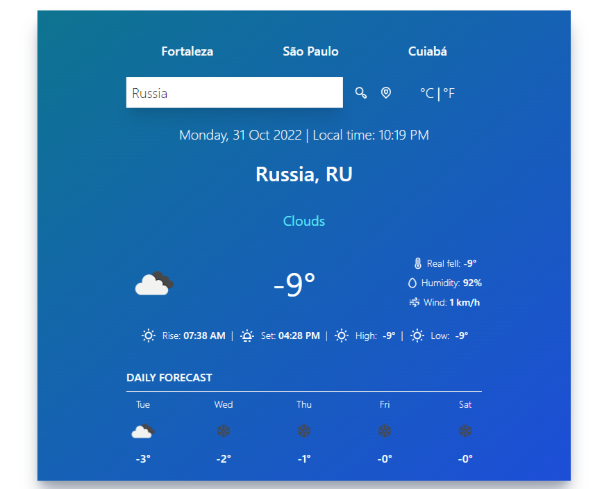
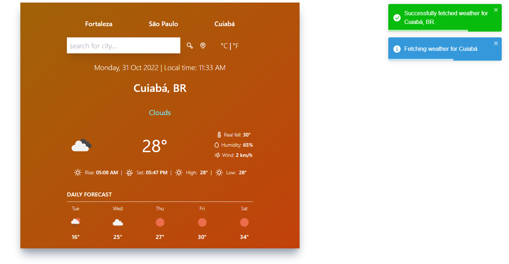

# Teste Autodoc

### Design

## Welcome! 👋

Projeto de uma aplicação que deverá requisitar à API de previsão do tempo e mostrar o resultado em um outro componente de visualização através de props.

- Foram adicionadas outras funcionalidades além de três botões com localidades distintas, como: Barra de pesquisa, conversão de Graus celsius para Graus Fahrenheit e previsões da semana (de acordo com cada dia da semana)

- A linguagem atribuída à aplicação é o inglês, com o objetivo de manter o padrão com os dados requisitados da API OpenWeather.

#

## The project

O projeto tem como objetivo desenvolver uma aplicação de previsão do tempo para a consulta e interação de pelo menos 3 cidades distintas.

Seus usuários devem ser capazes de:

- Visualize o layout ideal para o site, dependendo do tamanho da tela do dispositivo
- Realize a consulta de previsão do tempo de 3 cidades específicas
- Realize a consulta de previsão do tempo de qualquer cidade de interesse por meio da barra de pesquisa
- Veja os estados de foco para todos os elementos interativos na página
- Veja dados de temperatura mínima, previsão ao longo da semana, umidade, vento e sensação térmica.
- O usuário poderá ver o dia da semana, mês e horário específico de acodo com a região selecionada.
- O usuário também pode, caso permitir, selecionar a localização aproximada para obter dados da previsão do tempo da localidade em que se encontra.

OBS: A cor da aplicação deve mudar de acordo com o clima requisitado à API.

#

## Install

- Visual Studio
- yarn //install all dependencies
- npm start
#

## Deploy of my project

Meu projeto está hospedado no Netlify no link abaixo:
- [Netlify](https://test-autodoc-daniel-braga.netlify.app/)

#

## Built with

- [React](https://reactjs.org/) - JS library
- CSS custom properties
- Javascript
- TypeScript
- [OWM](https://openweathermap.org/) (API key)
- [Firebase Realtime Database](https://firebase.google.com/) (API key and project URL)
- React-toastify
- Luxon (dates and times)
- React Hooks
- React Unicons
- Redux
- Jest
